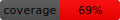

# NoisyCircuits

[](https://www.apache.org/licenses/LICENSE-2.0)
[](https://www.python.org/downloads/release/python-3100/)


[](https://github.com/mbd-rwth/NoisyCircuits/actions/workflows/run_test.yml)

A Python package for creating and simulating noisy quantum circuits using error models from IBM (Heron RX / Eagle RX) quantum hardware calibration data. The package implements the Monte-Carlo Wave Function (MCWF) method for efficient statevector simulation of noisy quantum systems.

The documentation for the package can be found [here](https://mbd-rwth.github.io/NoisyCircuits/).

## Overview

NoisyCircuits enables researchers and developers to:

- **Simulate realistic quantum noise** using calibration data from IBM QPU (Heron/Eagle) chipsets
- **Perform efficient noisy statevector simulations** with the Monte-Carlo Wave Function method
- **Validate quantum algorithms** under realistic hardware conditions  
- **Develop noise-aware quantum machine learning** applications
- **Compare quantum algorithms** between ideal and noisy regimes

### Key Features

**Hardware-Calibrated Noise Models**: Direct integration with IBM Quantum backend calibration data  
**Parallel Monte-Carlo Simulation**: Multi-core trajectory execution for scalable performance  
**Gate Set**: Support for IBM Eagle QPU basis gates (X, √X, Rz, ECR) and Heron QPU basis gates (X, √X, Rz, Rx, CZ, RZZ)  
**Validation Framework**: Built-in comparison with the density matrix method  
**Research Applications**: Ready-to-use examples for quantum machine learning and algorithm development  

### Supported Quantum Gates

The supported gated are fully decomposed into the hardware basis gates and this decomposition is applied to the circuit.

- **Single-qubit gates**: X, Y, Z, √X, Hadamard, Rx(θ), Ry(θ), Rz(θ)
- **Two-qubit gates**: ECR, CX, CY, CZ, CRx(θ), CRy(θ), CRz(θ), SWAP, RZZ(θ), RXX(θ), RYY(θ)
- **Unitary Operation**: Additionally, a unitary operator can be applied to the circuit. This unitary operator is not decomposed and is applied fully to the quantum circuit assuming a perfect implmenetation.

## Installation

### Prerequisites

- Python 3.10 or higher
- A conda-based environment manager ([Miniconda](https://docs.conda.io/en/latest/miniconda.html), [Anaconda](https://www.anaconda.com/), or [Micromamba](https://mamba.readthedocs.io/en/latest/user_guide/micromamba.html))
- IBM Quantum account and API token (for noise model access, optional. Sample Noise Data is made available.) for hardware submissions and direct pulls via API.

### Installation Steps

1. **Clone the repository:**
   ```bash
   git clone https://github.com/mbd-rwth/NoisyCircuits.git
   cd NoisyCircuits
   ```

2. **Create and activate the conda environment:**
   ```bash
   conda env create -f environment.yml
   conda activate NoisyCircuits
   ```

3. **Install the package:**
   ```bash
   pip install .
   ```

### Alternative Installation (Development Mode)

For development or if you plan to modify the code:
```bash
pip install -e .
```

### Dependencies

Core dependencies are automatically installed:
- **Qiskit**: IBM Quantum software stack
- **Ray**: Distributed computing for parallel execution
- **NumPy, Matplotlib**: Scientific computing and visualization
- **PyBind11**: C++ binder for python

## Examples and Validation

The `validation/` and `examples/` directories contains comprehensive validation and example notebooks:

### Validation Framework
- **Method Verification**: Statistical comparison between MCWF and exact density matrix simulation
- **Performance Benchmarking**: Trajectory convergence and computational efficiency analysis

### Example Applications
- **Quantum Machine Learning**: CFD parameter prediction using quantum neural networks
- **Algorithm Comparison**: Performance analysis under realistic noise conditions
- **Educational Resources**: Step-by-step tutorials for quantum noise simulation

**Quick Test**: Run the introduction notebook to validate your installation:
```bash
jupyter notebook examples/introduction.ipynb
```

For detailed information about the example suite, see [`examples/README.md`](examples/README.md).

## Method Verifiction

1. **[Method Verification](validation/method_verification.ipynb)**: Validation and accuracy testing of the MCWF method for noisy quantum circuit simulations compared against the density matrix simulation.

### Key Concepts
- **Parallel Execution**: Scaling simulations across multiple CPU cores (tested for shared memory architecture)
- **Statistical Validation**: Ensuring simulation accuracy through multiple metrics

## Examples

### Tutorials
1. **[Introduction](examples/introduction.ipynb)**: Basic usage and configuration
2. **[Quantum Neural Networks](examples/quantum_neural_networks.ipynb)**: Machine learning applications
3. **[Hardware Submission](examples/run_on_hardware.ipynb)**: Creating, submitting and retreiving results from IBM hardware.
4. **[Multiple Hardware Submissions](examples/run_multiple_on_hardware.ipynb)**: Creating, submitting and retreiving multiple quantum circuits from IBM Hardware.

### Key Concepts
- **Monte-Carlo Wave Function**: Efficient method for simulating open quantum systems
- **Hardware Noise Models**: Using real device calibration data for realistic simulations

## Contributing

We welcome contributions to NoisyCircuits! Here's how you can help:

### Types of Contributions

- **Bug Reports**: Report issues or unexpected behavior
- **Feature Requests**: Suggest new functionality or improvements
- **Documentation**: Improve tutorials, examples, or API documentation
- **Testing**: Add test cases or improve validation coverage
- **Code Contributions**: Implement new features or optimize existing code

### Development Workflow

1. **Fork the repository** and create a feature branch:
   ```bash
   git checkout -b feature/your-feature-name
   ```

2. **Set up development environment**:
   ```bash
   conda env create -f environment.yml
   conda activate NoisyCircuits
   pip install -e .  # Install in development mode
   ```

3. **Make your changes** and add tests if applicable

4. **Run the validation suite**:
   ```bash
   jupyter notebook test/method_verification.ipynb
   ```

5. **Submit a pull request** with a clear description of your changes

### Contribution Guidelines

- **Code Style**: Follow PEP 8 python style guidelines
- **Documentation**: Update docstrings and README files for new features
- **Testing**: Include test cases for new functionality
- **Backwards Compatibility**: Maintain compatibility with existing APIs when possible

### Getting Help

- **Issues**: Use GitHub Issues for bug reports and feature requests
- **Discussions**: Start a GitHub Discussion for questions and ideas

## License

This project is licensed under the Apache 2.0 License - see the [LICENSE](LICENSE) file for details.

## Citing NoisyCircuits

If you use NoisyCircuits in your research, please cite the software as follows:
```
@software{Hegde_NoisyCircuits_2026,
author = {Hegde, Sathyamurthy and Kowalski, Julia},
license = {Apache-2.0},
month = jul,
title = {{NoisyCircuits}},
url = {https://github.com/mbd-rwth/NoisyCircuits.git},
version = {2.0.0},
year = {2026}
}
```

## Support and Contact

- **Author**: Sathyamurthy Hegde
- **GitHub**: [@Sats2](https://github.com/Sats2)

---

*For more detailed information, examples, and tutorials, please refer to the documentation in the `examples/` directory.*
