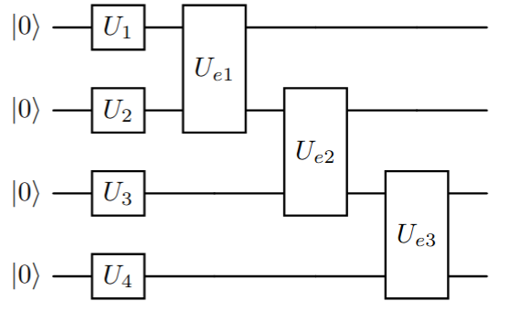
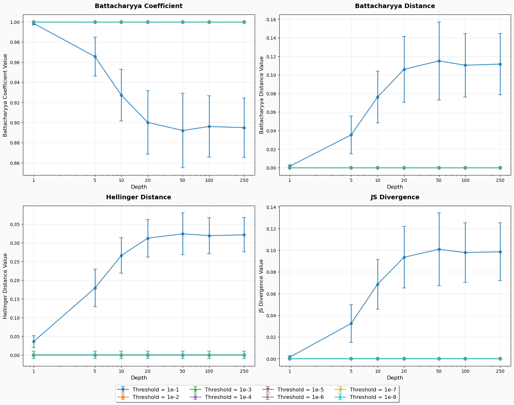
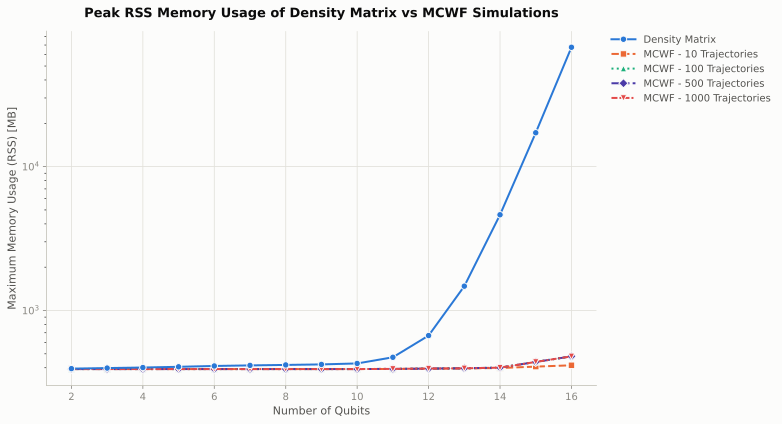
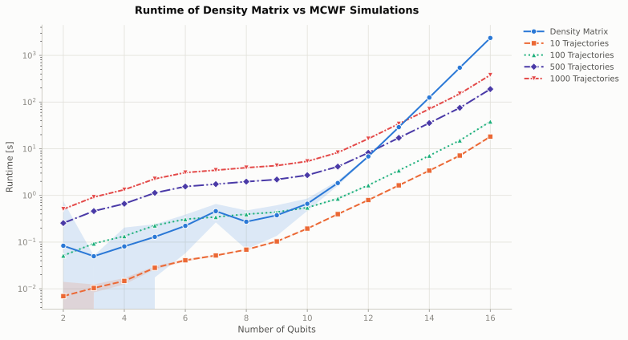

Method Comparisons
===================
This section provides a comparison between different methods for simulating noisy circuits. The focus is on two main aspects of the software. The first is the ability to filter out noise from the calibration data. The second is the performance comparison between Monte Carlo Wave Function (MCWF) simulations and Density Matrix simulations. 

Metrics
--------
To compare the different methods, we use the following metrics:

- **Battacharyya Coefficient:**  
  The Battacharyya Coefficient (BC) is a measure of similarity between two probability distributions.  
  It is defined as shown below, where :math:`P` and :math:`Q` are the two distributions being compared. 
  A BC value of :math:`1` indicates identical distributions, while a value of :math:`0` indicates completely disjoint distributions. :cite:p:`BC_BD`

  .. math::

     BC(P, Q) = \sum_i \sqrt{P(i)\, Q(i)}

- **Battacharyya Distance:**  
  The Battacharyya Distance (BD) is derived from the Battacharyya Coefficient and is defined as shown below. 
  A BD value of :math:`0` indicates identical distributions, while larger values indicate greater dissimilarity. :cite:p:`BC_BD`  

  .. math::

     BD(P, Q) = -\ln(\sum_i \sqrt{P(i)\, Q(i)})

- **Hellinger Distance:**  
  The Hellinger Distance (HD) is another measure of similarity between two probability distributions. It is defined as shown below. 
  A HD value of :math:`0` indicates identical distributions, while a value of :math:`1` indicates completely disjoint distributions. :cite:p:`HD`

  .. math::

     HD(P, Q) =  \frac{1}{\sqrt{2}} \sqrt{\sum_i (\sqrt{P(i)} - \sqrt{Q(i)})^2}

- **Jensen-Shannon Divergence:**  
  The Jensen-Shannon Divergence (JSD) is a symmetric measure of similarity between two probability distributions. It is defined as shown below, where :math:`M = \frac{1}{2}(P + Q)` and :math:`D_{KL}` is the Kullback-Leibler divergence. 
  A BD value of :math:`0` indicates identical distributions, while larger values indicate greater dissimilarity. :cite:p:`JS`

  .. math::

     JSD(P, Q) = \frac{1}{2} D_{KL}(P || M) + \frac{1}{2} D_{KL}(Q || M)

Setup
-----

For both comparisons, we use a randomized quantum circuit. The circuit consists of layers of single qubit gates followed by entagling gates on each pair of adjacent qubits. The depth of the circuit and the number of qubits in the circuit is varied to observe the performance under different noise levels. The randomized circuit blueprint is shown in Figure 1.

    Figure 1: Randomized Circuit Blueprint

The randomized circuit generation for the two cases are as follows:

- **Noise Filtering:** The number of qubits in the circuit is fixed to :math:`4` qubits. The single qubit gates are randomly chosen from :math:`\{X, Y, Z, \sqrt{X}, H, R_x(\theta), R_y(\theta), R_z(\theta) \}` and the entangling gates from :math:`\{CX, CY, CZ \}`. The rotation angles for the parametrized gates are sampled randomly from a normal distribution :math:`\mathcal{N}(0, 2\pi)`. The initial state of the circuit is also randomly initialized from a uniform distribution over the Hilbert Space of the :math:`4` qubits, but kept constant when varying the depth of the circuit. This randomized experiment is repeated for a total of :math:`100` times for each of the depths :math:`\{1, 5, 10, 20, 50, 100, 250\}`, with each repeated run starting at a different initial state :math:`|\psi\rangle`. The noise model used for each single qubit gate is given below:

+-------------------+-----------------------+
| Error Instruction |      Probability      |
+-------------------+-----------------------+
|        I-I        |   0.9521977439010979  |
+-------------------+-----------------------+
|        I-Z        |   0.0164082737956068  |
+-------------------+-----------------------+
|      I-Reset      |  0.013588129921428271 |
+-------------------+-----------------------+
|        X-I        | 1.777030358953864e-05 |
+-------------------+-----------------------+
|        X-Z        | 2.939666582579276e-10 |
+-------------------+-----------------------+
|      X-Reset      | 2.434416438154702e-09 |
+-------------------+-----------------------+
|        Y-I        |  0.01777030358953864  |
+-------------------+-----------------------+
|        Y-Z        | 2.939666582579276e-10 |
+-------------------+-----------------------+
|      Y-Reset      | 2.434416438154702e-09 |
+-------------------+-----------------------+
|        Z-I        | 1.777030358953864e-05 |
+-------------------+-----------------------+
|        Z-Z        | 2.939666582579276e-10 |
+-------------------+-----------------------+
|      Z-Reset      | 2.434416438154702e-09 |
+-------------------+-----------------------+

Additionally, the above noise is only applied to single qubit gates and the entangling gates are assumed to be ideal (this is done for the purpose of simplification).

- **MCWF Vs Density Matrix Simulations:** The randomized circuit for this case are all initialized to the state :math:`|0\rangle`. The number of qubits in the circuit are varied from :math:`2` qubits to :math:`16` qubits. The time and memory benchmarks are performed with a circuit depth of :math:`100`. The fidelity benchmark is performed for the depths: :math:`\{1, 50, 100, 200\}`. The single qubit gates are randomly chosen from :math:`\{X, \sqrt{X}, R_x(\theta), R_z(\theta) \}` and the entangling gates chosen from :math:`\{CZ, RZZ(\theta) \}`. The angles for the parametrized gates are randomly sampled from a uniform distribution - :math:`\mathcal{U}(-2\pi, 2\pi)`. This randomized experiment is repeated :math:`40` times. An actual noise model from the calibration data of an IBM Qauntum device is used for this benchmark where every gate applied in the circuit is subject to noise. Given below is the system setup used for the benchmark.

+-----------+----------------------+---------------------+--------------------+
| Benchmark | Number of Cores Used | Total Available RAM | System Exclusivity |
+-----------+----------------------+---------------------+--------------------+
|   Memory  |           50         |        1TB          |          No        |
+-----------+----------------------+---------------------+--------------------+
|   Time    |           50         |       256GB         |          Yes       |
+-----------+----------------------+---------------------+--------------------+
| Fidelity  |           50         |        1TB          |          No        |
+-----------+----------------------+---------------------+--------------------+

Noise Filtering
---------------
Noise models from real-world quantum devices show a relatively large chance of success, especially for single qubit gates :cite:p:`GEZ21`. The noise model built from the calibration data generated from the `Randomized Benchmark <https://en.wikipedia.org/wiki/Randomized_benchmarking>`_ tests :cite:p:`randomized_benchmark` performed on the hardware is very comprehensive. The idea of noise filtering is to remove low probability noise instructions from the noise model to reduce the computational overhead from many Kraus operators with very low probabilities and reduce the memory consumption during the simulation.

    Figure 2: Noise Filtering Results

From figure 2, it can be inferred that the noise model can be safely filtered as long as the specified threshold is low enough to not significantly affect the open quantum system evolution.

MCWF Vs Density Matrix Simulation
---------------------------------

In this section, we compare the performance of the Monte-Carlo Wavefunction (MCWF) simulation method against the Density Matrix simulation method for varying circuit sizes and depths. The comparison is based on the Hellinger Distance and the Jenson-Shannon Divergence metrics. For the MCWF simulations, we also compare the influence of the number of trajectories on the accuracy of the results to determine a reasonable numbber of trajectories that can be used to get a good approximation.

.. container:: plot-grid

  .. container:: plot-row

    .. image:: ../assets/Fidelity_Benchmark_Depth_1_Hellinger_Distance.svg
      :width: 45%
      :alt: Hellinger Distance for circuit depth of 1
      :class: plot-img

    .. image:: ../assets/Fidelity_Benchmark_Depth_50_Hellinger_Distance.svg
      :width: 45%
      :alt: Hellinger Distance for circuit depth of 50
      :class: plot-img

  ..container:: plot-row

    .. image:: ../assets/Fidelity_Benchmark_Depth_100_Hellinger_Distance.svg
      :width: 45%
      :alt: Hellinger Distance for circuit depth of 100
      :class: plot-img

    .. image:: ../assets/Fidelity_Benchmark_Depth_200_Hellinger_Distance.svg
      :width: 45%
      :alt: Hellinger Distance for circuit depth of 200
      :class: plot-img
  
  ..container:: plot-caption

    Figure 3: Hellinger Distance Comparison between MCWF and Density Matrix Simulations at depths 1, 50, 100 and 200.

From figure 3, it can be observed that the MCWF simulation method achieves a low distance value when using the Hellinger Distance across circuit size/depth. The accuracy improves with increases to the trajectory count, with :math:`1000` trajectories providing the best results. This behaviour is also reflected in the Jensen-Shannon Divergence results shown in figure 4.

.. container:: plot-grid

  .. container:: plot-row

    .. image:: ../assets/Fidelity_Benchmark_Depth_1_JS_Divergence.svg
      :width: 45%
      :alt: Hellinger Distance for circuit depth of 1
      :class: plot-img

    .. image:: ../assets/Fidelity_Benchmark_Depth_50_JS_Divergence.svg
      :width: 45%
      :alt: Hellinger Distance for circuit depth of 50
      :class: plot-img

  ..container:: plot-row

    .. image:: ../assets/Fidelity_Benchmark_Depth_100_JS_Divergence.svg
      :width: 45%
      :alt: Hellinger Distance for circuit depth of 100
      :class: plot-img

    .. image:: ../assets/Fidelity_Benchmark_Depth_200_JS_Divergence.svg
      :width: 45%
      :alt: Hellinger Distance for circuit depth of 200
      :class: plot-img
  
  ..container:: plot-caption

    Figure 4: Jenson-Shannon Divergence Comparison between MCWF and Density Matrix Simulations at depths 1, 50, 100 and 200.

The result of the memory benchmark is shown below in figure 5 where tthe peak Resident Set Size (RSS) of the process is measured using the `usr/bin/time -v` command on a linux machine.

  Figure 5: Results of the Memory Benchmark of the MCWF and Density Matrix Simulation methods at a circuit depth of 100.

The result of the runtime benchmark is shown below in figure 6. This benchmark was performed on a High Performance Computer cluster with a single node completely blocked and the benchmark performed on this node exclusively (no other tasks/process execpt OS processes on this node).

  Figure 6: Results of the Runtime Benchmark of the MCWF and Density Matrix Simulation methods at a circuit depth of 100.

From the benchmark results, it can be concluded that the MCWF method is a viable alternative to the Density Matrix simulation method, especially for larger/deeper circuits where computational resources requirements for Density Matrix simulations can become prohibitive. The choice of the number of trajectories in the MCWF method is crucial to balance accuracy and computational efficiency. From the fidelity experiments, using :math:`100` trajectories seems to be sufficient with diminishing returns after :math:`500` trajectories.

Reproducibility
---------------

The above benchmarks can be reproduced (however, please be aware that runtime benchmarks require exclusive machine access in order to avoid unneccessary interferences that make results unusable) by using the benchmark scripts and visualization notebook available in the git repository `NoisyCircuits_Benchmark <https://github.com/Sats2/NoisyCircuits_Benchmark>`_ .

Additionally, this repository also contains a notebook for local verification (restricted to smaller system sizes due to longer runtimes of the density matrix simulations) and result visualization which uses all available simulation backends. The `verification` folder is linked below:

- :doc:`Verification Script <verification/method_verification>`
  
.. toctree::
  :maxdepth: 1
  :caption: Reproducibility
  :hidden:

  verification/method_verification

Conclusion
----------
From the benchmarks, it is evident that both noise filtering and using the MCWF method offer significant advantages in terms of computational efficiency without compromising on accuracy. Noise Filtering effectively reduces the complexity of the noise model leading to faster simulations (both with the density matrix and MCWF methods). The MCWF method provides a scalable alternative to density matrix simulations, particularly for larger circuits which still maintaining high accuracy with an appropriate choice of trajectories. These methods are valuable tools for simulating noisy quantum circuits and can be tailored to specific requirements based on the desired balance between computational efficiency and accuracy.